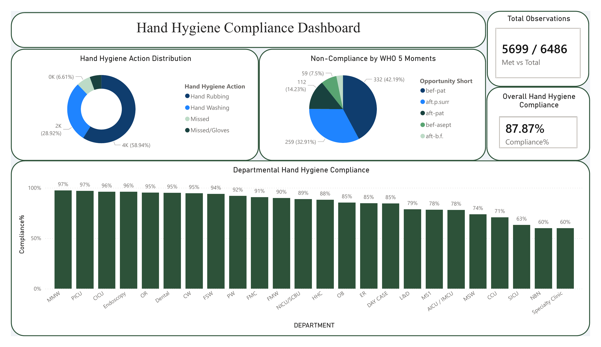
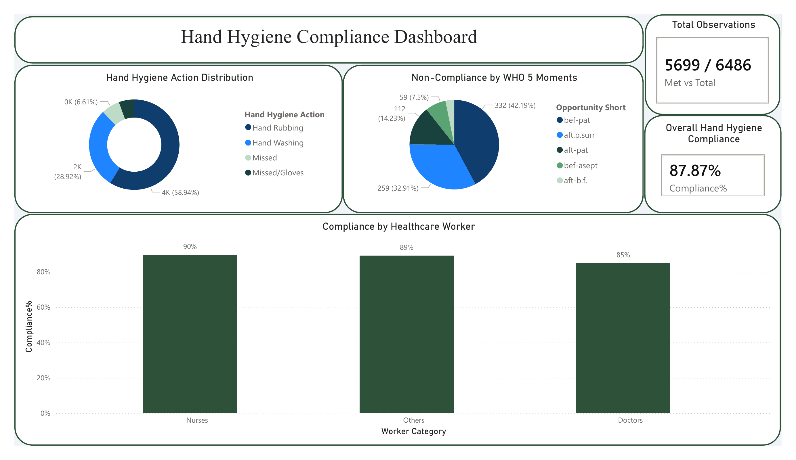
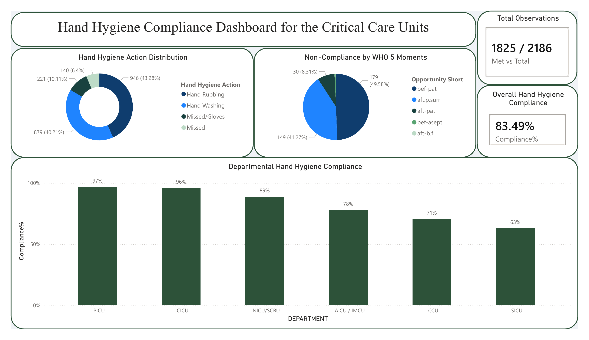

# Hand Hygiene Compliance Monitoring System
### Automated ETL Pipeline & Interactive Power BI Dashboard

---

## Project Overview
A fully automated, end-to-end data pipeline that transformed a manual, paper-based Hand Hygiene auditing process into a real-time, zero-touch compliance monitoring system for a hospital with **24 departments** and **6,486 quarterly observations**. The solution covers the entire data lifecycle — from mobile data collection by frontline medical staff to automated cleaning, transformation, and interactive dashboard delivery.

---
### Dashboard Preview




---

## The Problem
| Challenge | Impact |
|-----------|--------|
| Audits collected on paper forms | Slow, error-prone data entry |
| Manual Excel compilation each month | Hours of repetitive work |
| No standardized data format | Inconsistent reporting across departments |
| Complex worker type codes (e.g., "2.16 Primary Care Physician") | Difficult to analyze by category |
| Static monthly reports | No real-time visibility for hospital leadership |
| No historical trend tracking | Unable to identify compliance patterns |

---

## The Solution
A three-layer automated system:

**Layer 1 — Smart Data Collection (SmartSheet)**
Designed a SmartSheet form that allows nursing staff to submit **5 audits in a single submission**, making it fast and mobile-friendly. All fields use **dropdown lists only** (not free text) — eliminating typos and data quality issues at the source before they enter the system.

**Layer 2 — Automated ETL Pipeline (Python)**
A Python script runs daily via Windows Task Scheduler:
- **Extracts** data from SmartSheet via API (zero manual downloads)
- **Transforms** and cleans the data (handling 15-column restructuring, date validation, WHO 5 Moments mapping)
- **Loads** the clean data into an Excel file with automatic backup and smart date-based merging

**Layer 3 — Interactive Dashboard with Auto-Refresh (Power BI)**
A 10-page Power BI dashboard connected via Gateway that refreshes automatically — giving hospital leadership real-time compliance visibility across all departments, worker categories, and care areas without anyone clicking a button.

---

## Architecture

```
┌─────────────────────────────────────────────────────────────────┐
│                     DATA COLLECTION                             │
│                                                                 │
│  SmartSheet Form (Mobile-Friendly)                              │
│  • 5 audits per submission — fast for busy nursing staff        │
│  • Dropdown lists only — no free text, no typos                 │
│  • Fields: Department, Date, Time, Worker Type,                 │
│    Opportunity (WHO 5 Moments), Hand Hygiene Action             │
│  • Distributed via link to staff across 24 departments          │
└──────────────────────────┬──────────────────────────────────────┘
                           │
                           ▼
┌─────────────────────────────────────────────────────────────────┐
│                     EXTRACT (7:00 AM Daily)                     │
│                                                                 │
│  Python script triggered by Windows Task Scheduler              │
│  • Connects to SmartSheet API automatically                     │
│  • Pulls all audit data (zero manual downloads)                 │
│  • Reads existing historical data from jan.xlsx                 │
│  • Creates dated backup before any changes                      │
└──────────────────────────┬──────────────────────────────────────┘
                           │
                           ▼
┌─────────────────────────────────────────────────────────────────┐
│                     TRANSFORM                                   │
│                                                                 │
│  Python Data Cleaning:                                          │
│  • Restructures 15 repeated columns into 3 clean columns        │
│  • Deletes rows with missing dates (prevents contamination)     │                                                          │
│  • Maps abbreviations to WHO 5 Moments full text                │
│  • Strips whitespace and standardizes formatting                │
│  • Smart merge: keeps historical data, adds only new dates      │
│                                                                 │
│  Power Query Transformations (Power BI):                        │
│  • Categorizes 15+ worker sub-specialties into clean groups:    │
│    "Doctors", "Nurses", "Others"                                │
│  • Extracts worker type name from coded values                  │
│  • Promoted headers, type changes, column cleanup               │
└──────────────────────────┬──────────────────────────────────────┘
                           │
                           ▼
┌─────────────────────────────────────────────────────────────────┐
│                     LOAD (8:00 AM Daily)                        │
│                                                                 │
│  Power BI Gateway reads updated jan.xlsx                        │
│  Scheduled refresh triggers automatically                       │
│  10-page dashboard updates — zero manual intervention           │
└─────────────────────────────────────────────────────────────────┘
```

---

## Dashboard Overview (10 Pages)

### Page 1: Title Page
**COMPLIANCE OF HAND HYGIENE — First Quarter**

### Page 2-3: Overall Hospital Compliance
- **5,699 / 6,486** total observations — **87.87%** compliance
- Hand Hygiene Action distribution (Donut Chart)
- Non-Compliance by WHO 5 Moments (Bar Chart)
- All **24 departments** ranked by compliance (Horizontal Bar)
- Worker category comparison: Nurses **90%**, Others **89%**, Doctors **85%**

### Pages 4-5: Critical Care Units
- **1,825 / 2,186** observations — **83.49%** compliance
- 6 units: PICU, CICU, NICU/SCBU, AICU/IMCU, CCU, SICU
- Highest: PICU **97%** | Lowest: SICU **63%**

### Pages 6-7: In-patient Care Areas
- **2,469 / 2,698** observations — **91.51%** compliance
- 11 departments from MMW **97%** to NBN **60%**

### Pages 8-9: Out-patient Care Areas
- **798 / 886** observations — **90.07%** compliance
- 6 departments from Endoscopy **96%** to Specialty Clinic **60%**

### Page 10: Accident & Emergency Unit
- **607 / 716** observations — **84.78%** compliance
- Nurses **90%**, Others **79%**, Doctors **71%**
- Top non-compliance moment: Before contact with patient **47.71%**
  
## Advanced DAX Measures

We engineered custom DAX measures to give hospital leadership actionable, drill-down insights — not just basic counts:

### Overall Compliance Percentage
```dax
Compliance% = 
DIVIDE 
    CALCULATE(COUNTROWS('JAN 26'), 
        'JAN 26'[Hand Hygiene Action] IN {"Hand Rubbing", "Hand Washing"}),
    COUNTROWS('JAN 26'),
    0
)
```

### Dynamic "Met vs Total" KPI Card
Custom text measure combining multiple metrics into a single clear KPI:
```dax
TotalAudits = 
VAR Met = CALCULATE(COUNTROWS('JAN 26'), 
    'JAN 26'[Hand Hygiene Action] IN {"Hand Rubbing", "Hand Washing"})
VAR Total = COUNTROWS('JAN 26')
RETURN Met & " / " & Total
```

### Non-Compliance Count (WHO 5 Moments)
```dax
Missed Count = 
CALCULATE(COUNTROWS('JAN 26'), 
    'JAN 26'[Hand Hygiene Action] IN {"Missed", "Missed/Gloves"})
```

### Worker Category Classification
Dynamic grouping of 15+ healthcare worker sub-specialties into clean reporting categories:
```dax
Worker Category = 
SWITCH(TRUE(),
    CONTAINSSTRING('JAN 26'[Healthcare Worker Type], "Nurse"), "Nurses",
    CONTAINSSTRING('JAN 26'[Healthcare Worker Type], "Physician"), "Doctors",
    CONTAINSSTRING('JAN 26'[Healthcare Worker Type], "Surgeon"), "Doctors",
    CONTAINSSTRING('JAN 26'[Healthcare Worker Type], "Cardiologist"), "Doctors",
    CONTAINSSTRING('JAN 26'[Healthcare Worker Type], "Intensivist"), "Doctors",
    CONTAINSSTRING('JAN 26'[Healthcare Worker Type], "Internal Medicine"), "Doctors",
    CONTAINSSTRING('JAN 26'[Healthcare Worker Type], "Pediatrician"), "Doctors",
    CONTAINSSTRING('JAN 26'[Healthcare Worker Type], "Primary Care"), "Doctors",
    "Others"
)
```

### Opportunity Short Labels
```dax
Opportunity Short = 
SWITCH('JAN 26'[Opportunity],
    "Before contact with the patient", "bef-pat",
    "After contact with the patient", "aft-pat",
    "After contact with the patient's surroundings", "aft.p.surr",
    "Before aseptic/clean procedure", "bef-asept",
    "After blood/body fluids exposure risk", "aft-b.f.",
    'JAN 26'[Opportunity]
)
```

### Month Name Extraction
```dax
Month Name = FORMAT('JAN 26'[AUDIT DATE], "MMMM")
```

### Targeted Compliance Filtering
Measures that dynamically filter compliance by specific roles and departments — enabling leadership to isolate metrics like "Physician compliance in Critical Care Units" or "Nurse compliance in ER" with a single click through Power BI slicers.

---

## Reporting Capabilities

| Report Type | Description |
|-------------|-------------|
| Monthly | Compliance trends per department per month |
| Quarterly | Q1, Q2, Q3, Q4 summary with comparative analysis |
| Yearly | Annual compliance overview and year-over-year trends |
| By Department | Individual department drill-down (24 departments) |
| By Care Area | Critical Care, In-patient, Out-patient, ER |
| By Worker Type | Nurses vs Doctors vs Others comparison |
| By WHO 5 Moments | Non-compliance breakdown by specific moment |

---

## SmartSheet Form Design

The data collection form was designed with frontline staff in mind:

- **5 audits per submission** — staff record multiple observations in one go, reducing form fatigue during busy shifts
- **All dropdown lists** — Department, Healthcare Worker Type, WHO 5 Moments Opportunity, and Hand Hygiene Action are all pre-defined selections
- **No free text fields** — eliminates typos, abbreviation inconsistencies, and data quality issues at the source
- **Mobile-optimized** — nurses and auditors fill the form directly from their phones during rounds
- **Shared via link** — distributed to auditing staff across all 24 departments

---

## Data Cleaning Steps (Python ETL Script)

| Step | Description |
|------|-------------|
| Column Restructuring | Combines 15 repeated columns (Worker Type 1-5, Opportunity 1-5, HH Action 1-5) into 3 single columns stacked as rows |
| Date Validation | Deletes any row with missing date — entire audit removed if no date exists |
| Whitespace Cleaning | Strips leading/trailing spaces and standardizes null values |
| Abbreviation Mapping | Converts short codes to WHO 5 Moments full text (bef-pat → Before contact with the patient) |
| Smart Merge | Keeps all historical data intact; only adds rows with new dates to prevent duplication |
| Automatic Backup | Creates a dated backup file before every update |
---

## Technical Stack

| Tool | Purpose |
|------|---------|
| **SmartSheet** | Data collection — mobile forms with dropdown validation |
| **SmartSheet API** | Automated data extraction via Python |
| **Python 3.13** | ETL script — extraction, cleaning, transformation |
| **pandas** | Data manipulation and transformation library |
| **Power BI Desktop** | Dashboard design, DAX measures, Power Query transformations |
| **Power BI Service** | Online dashboard publishing and sharing |
| **Power BI Gateway** | Automated scheduled refresh |
| **Power Query** | Worker type categorization and data shaping |
| **DAX** | Custom measures for compliance KPIs and dynamic filtering |
| **Windows Task Scheduler** | Daily automated script execution |
| **GitHub** | Version control and project documentation |

---

## Project Files

| File | Description |
|------|-------------|
| `update_hh.py` | Main ETL script — runs daily via Task Scheduler |
| `HH_Audit_ETL_Pipeline.ipynb` | Google Colab version (alternative for non-Python environments) |
| `Hand Hygiene Dashboard.pbix` | Power BI dashboard — 10 pages with all measures and visualizations |

---

## Automation Schedule

| Time | Action | Method |
|------|--------|--------|
| **7:00 AM** | Python pulls data from SmartSheet → cleans → saves to Excel with backup | Windows Task Scheduler |
| **8:00 AM** | Power BI reads updated Excel → refreshes all 10 dashboard pages | Power BI Gateway (scheduled) |

**Result: Fully automated, zero-touch daily reporting system.**

---

## Impact

| Before | After |
|--------|-------|
| Paper-based audits | Mobile SmartSheet forms (5 audits per submit) |
| Manual data entry (hours per month) | Automated API extraction (seconds) |
| Inconsistent data with typos | Dropdown-enforced data quality |
| Complex worker codes (e.g., "2.16 Primary Care Physician") | Clean categories: Doctors, Nurses, Others |
| Monthly static Excel reports | Real-time interactive 10-page dashboard |
| No historical tracking | Full trend analysis (monthly/quarterly/yearly) |
| Basic compliance counts | Advanced DAX-driven KPIs with dynamic filtering |
| Manual refresh required | Fully automated daily refresh at 8 AM |
| Hours of monthly reporting work | **Zero manual intervention** |

---

## How to Replicate This Project

### Prerequisites
- Python 3.x installed
- SmartSheet account with API access
- Power BI Desktop + Power BI Service account
- Power BI Gateway installed

### Setup Steps
1. Clone this repository
2. Install Python dependencies: `pip install smartsheet-python-sdk pandas openpyxl`
3. Update `update_hh.py` with your SmartSheet API key and Sheet ID
4. Update the `SAVE_PATH` to match your file location
5. Connect Power BI to the output Excel file
6. Build DAX measures and Power Query transformations
7. Set up Windows Task Scheduler to run the script daily at 7 AM
8. Install Power BI Gateway and configure scheduled refresh at 8 AM

### Configuration
```python
SMARTSHEET_API_KEY = 'YOUR_API_KEY_HERE'      # SmartSheet → Profile → API Access
SMARTSHEET_SHEET_ID = 'YOUR_SHEET_ID_HERE'    # SmartSheet → File → Properties
SAVE_PATH = r'YOUR_FILE_PATH\jan.xlsx'        # Path where Power BI reads the file
```

---

## Authors
- **Manar** — [GitHub Profile](https://github.com/Manar501)
- **Norah** — Contributor

---

## Links
- **Power BI Dashboard**: [View the live dashboard](https://seuedu-my.sharepoint.com/personal/s200088111_seu_edu_sa/_layouts/15/onedrive.aspx?id=%2Fpersonal%2Fs200088111_seu_edu_sa%2FDocuments%2FHH%20Report.pbix&parent=%2Fpersonal%2Fs200088111_seu_edu_sa%2FDocuments&ga=1)
